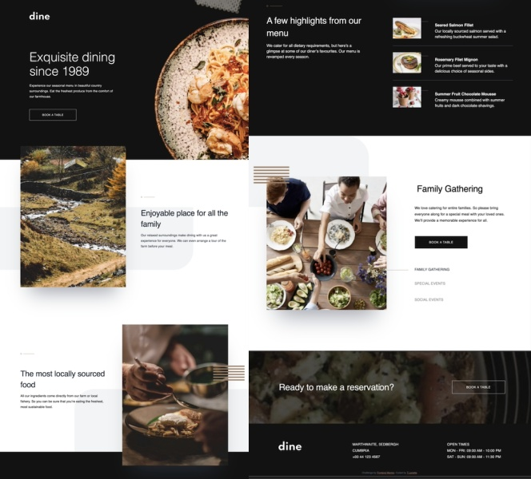
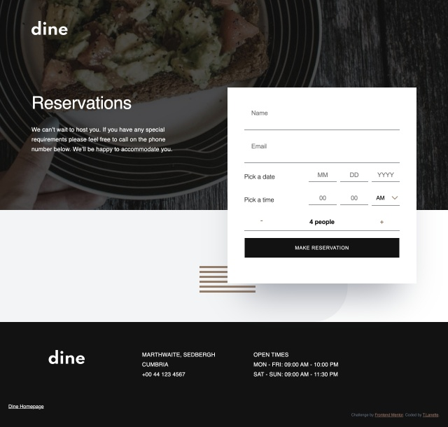
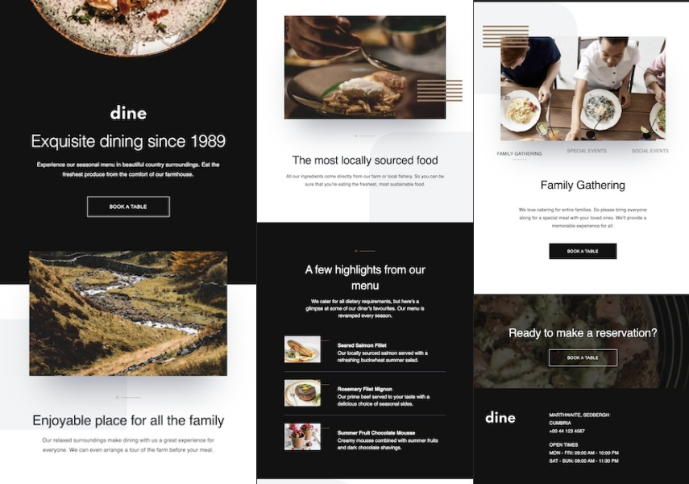
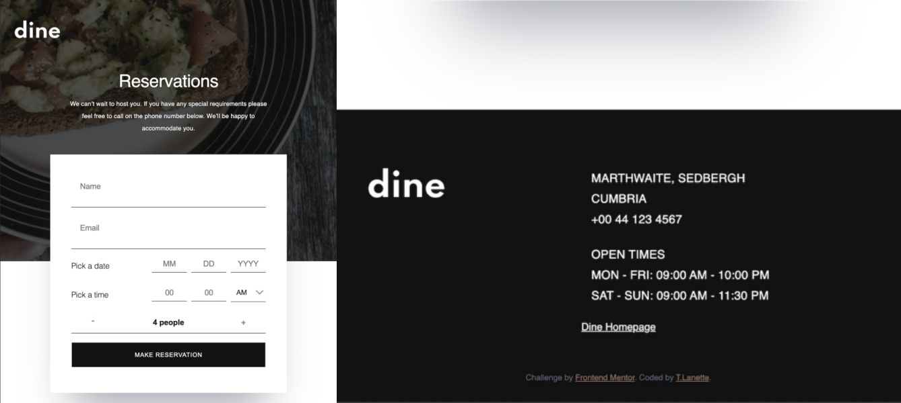
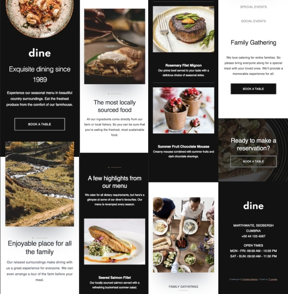
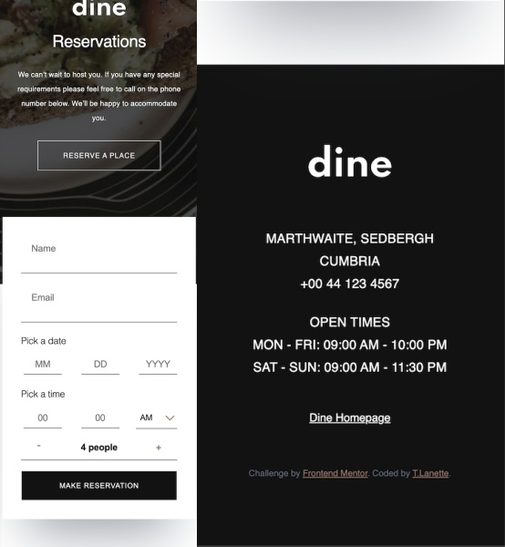

# Frontend Mentor - Dine-Restaurant-Site-TLP
Frontend Mentor Challenge: Multipage Dine Restaurant Site with form validation. 


This is a solution to the [Multipage Dine Restaurant Site challenge on Frontend Mentor](https://www.frontendmentor.io/challenges/dine-restaurant-website-yAt7Vvxt7/hub/dine-restaurant-website-kHPDTFLP8). Frontend Mentor challenges help you improve your coding skills by building realistic projects. 

## Table of contents

- [Overview](#overview)
  - [The challenge](#the-challenge)
  - [Screenshots](#screenshots)
  - [Links](#links)
- [My process](#my-process)
  - [Built with](#built-with)
  - [What I learned](#what-i-learned)
  - [Continued development](#continued-development)
  - [Useful resources](#useful-resources)
- [Author](#author)
- [Acknowledgments](#acknowledgements)

## Overview

### The challenge

Users should be able to:

- View the optimal layout for the site depending on their device's screen size
- See hover states for all interactive elements on the page
- View the current time and location information based on their IP address
- View additional information about the date and time in the expanded state
- Be shown the correct greeting and background image based on the time of day they're visiting the site
- Generate random programming quotes by clicking the refresh icon near the quote

### Screenshots
#### Desktop Home and Booking pages

***

***

#### iPad Home and Booking pages

***

***

#### iPhone 6/7/8 Home and Booking pages

***

***

I have included two screen shots of four devices: 
* iPhone 6/7/8 (375x667)
* iPad (768x1024)
* Laptop (1280x950)

I used an awesome open-source devtool app called [Responsively](https://opencollective.com/responsively). It allowed me to see the calculator on different sized devices live while I was editing. You can inspect the code and take screen shots.  I also used the [Photoscape app](http://www.photoscape.org/ps/main/index.php). It's a free photo editing app (you can pay for extras). I was able to combine screenshots of each area of my Dine webpages and resize the final photo. 

### Links

- Solution URL: Here's my solution link - [Add solution URL here]
- Live Site URL: Here's my finished site - [Dine Restaurant](https://dine-restaurant-site-tlp.vercel.app/)

## My process

### Built with

- Semantic HTML5 markup
- CSS custom properties
- Flexbox
- Mobile-first workflow
- [Sass](https://sass-lang.com/)

### What I learned

I learned that inserting pictures as a background-image gives you more flexibility in placement on the page. I used media queries to insert different sized images. I also learned about using transform/translate to position elements instead of using margin. 

My code snippets, see below:

```css
.hero {
    width: 100vw;
    height: 74.8rem;
    text-align: center;
    background-repeat: no-repeat;
    background-attachment: fixed;
    background-size: cover;
    background-position: center center;
    padding-top: 23.2rem;
    padding-right: 2.4rem;
    padding-left: 2.4rem;
    
    background-image: url(/images/homepage/hero-bg-mobile@2x.jpg);

    @media (min-width: $bp-tablet-start) {
        height: 92.2rem;
        padding-top: 37.4rem;
        background-image: url(/images/homepage/hero-bg-tablet@2x.jpg);
    }
    
    @media (min-width: $bp-desktop) {
        height: 82rem;
        padding-top: 6.5rem;
        padding-left: 15.5rem;
        text-align: left;
        background-image: url(/images/homepage/hero-bg-desktop@2x.jpg);
    }
 }

```
### Continued development

I will continue to focus on CSS positioning elements, understanding absolute/relative positioning, and working with pseudo-elements (::before and ::after).  

### Useful resources

I used a lot of references and resources in addition to Google and StackOverflow to build my restaurant page. 
* [CSS-Tricks - Rems & Ems](https://css-tricks.com/rems-ems/) - Reviewed how to use responsive sizing specifically for font sizes.
* [Stack Overflow](http://www.regular-expressions.info/) - Using regular expressions to check email address validity.
* [Sass and Media Queries - What You Can and Can't Do](https://designshack.net/articles/css/sass-and-media-queries-what-you-can-and-cant-do/) - Reviewed using Sass and media queries
* [CSS Media Queries, Breakpoints, Media Types](https://www.freecodecamp.org/news/css-media-queries-breakpoints-media-types-standard-resolutions-and-more/),
[Sass and Media Queries](https://dev.to/paul_duvall/sass-and-media-queries-hb2) - Used to adjust my media queries by using a mixin with a range of sizes.


## Author

- Website - [T.Lanette Pollard](https://tlp-portfolio.vercel.app/)
- Frontend Mentor - [@TLanetteRose](https://www.frontendmentor.io/profile/TLanetteRose)
- Twitter - [@TpLanetteNBCT](https://twitter.com/TpLanetteNBCT)


## Acknowledgments

This is where you can give a hat tip to anyone who helped you out on this project. Perhaps you worked in a team or got some inspiration from someone else's solution. This is the perfect place to give them some credit.

**Note: Delete this note and edit this section's content as necessary. If you completed this challenge by yourself, feel free to delete this section entirely.**
